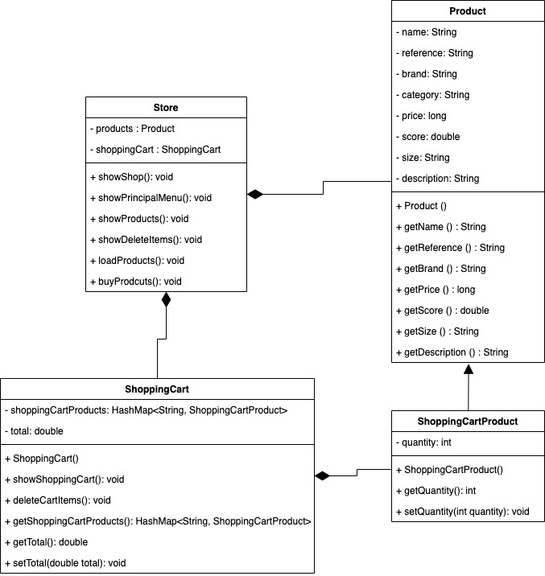

# Decathlon's camping kit 🏕️

Hi!
In this challenge I show you important concepts of POO using Java.

This time, I'll show you the implementation of a _shopping cart_ based in the Decathlon's shop.

This is the **UML Class Diagram** for this use-case:

----
By: Angel Mateo Gonzalez Bejarano, Endava. 2023