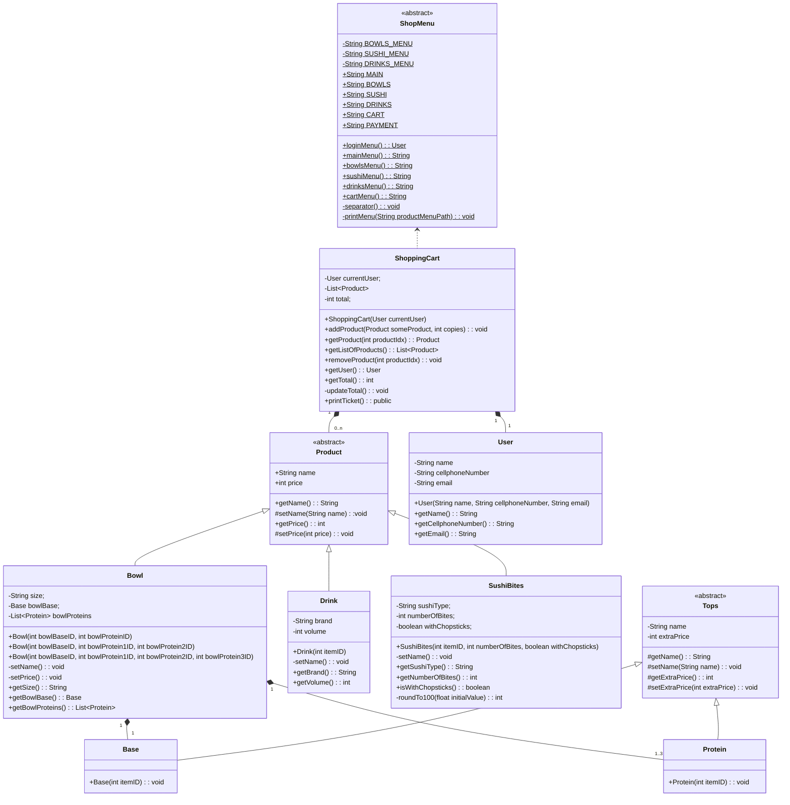

# Sr. Wok's Lunch Menu

Hello dear reader.

This folder contains a Java project with a program for purchasing diferent kinds of 
Sr. Wok products and interact with them.

You can add products, remove products, navigate through Bowls, Sushi and Drinks 
menus, and, you can checkout the status of your shopping cart.

The program itself runs on console, some data validation is implemented but you 
should be carrefull still, the program at this stage may not forgive you.

For single input just type a number and press enter.
For multiple input (Bowls creation) you must type the options separated by simple
space (i.e: `1 2 3`).

This program is based on the Rappi's Sr. Wok store, the prices were created 
accordingly and the language is spanish for the UI.

v1.0.0.

